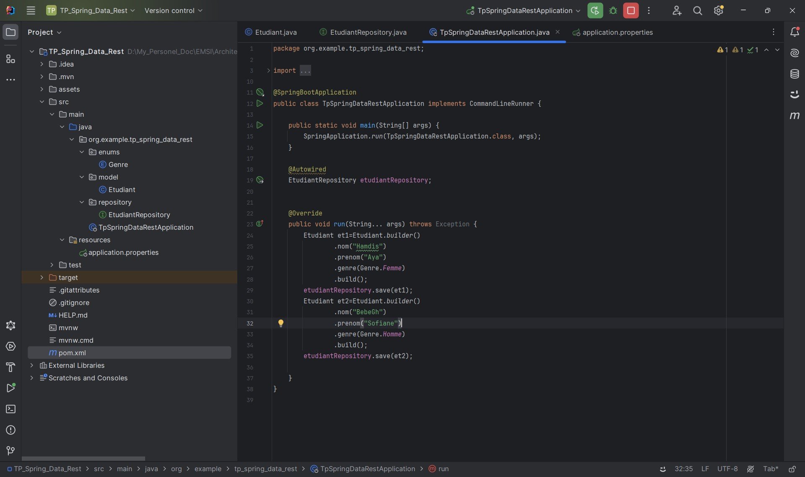
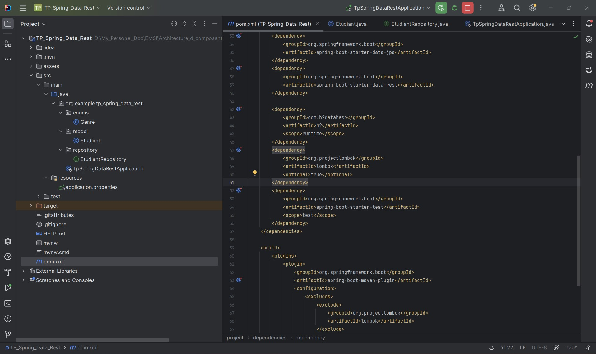
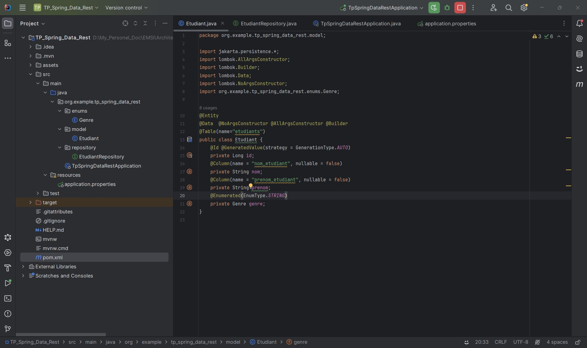
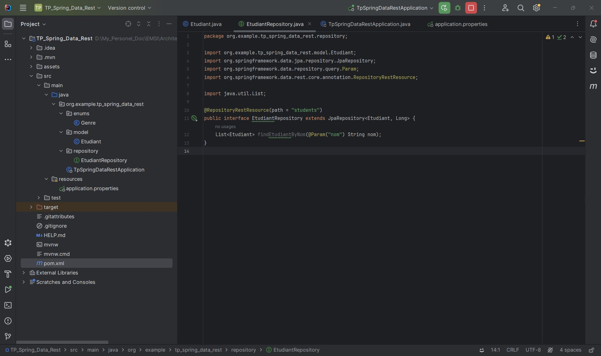
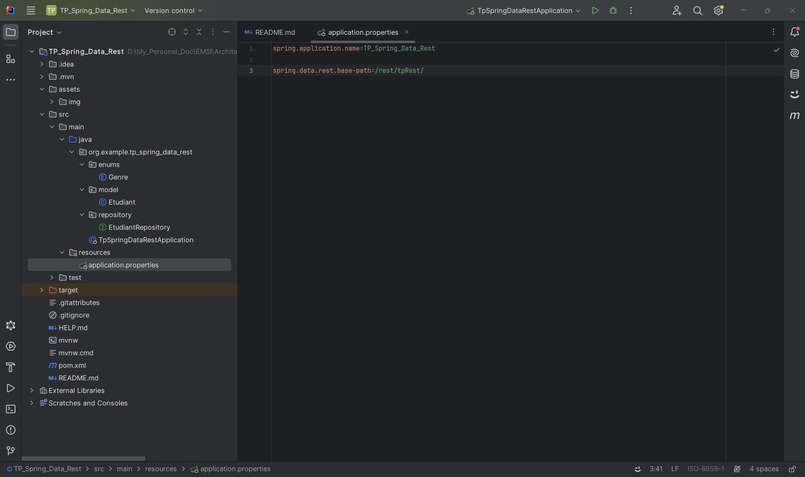
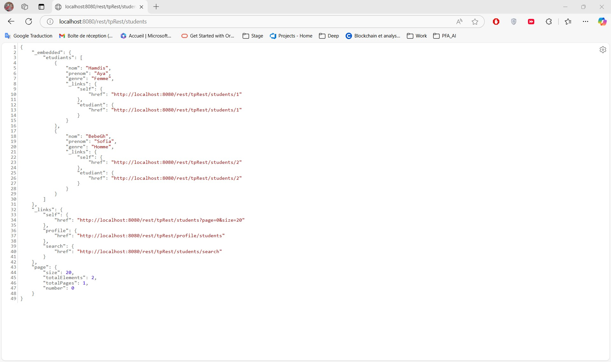
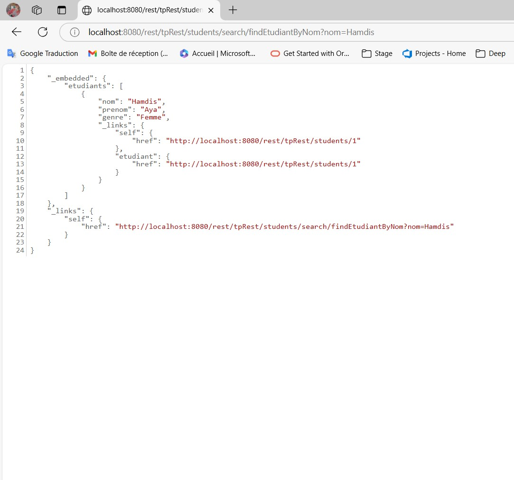

<h2>Compte rendu - TP Spring Data Rest</h2>

<h3>1. Créer un projet Spring Boot et Ajouter les dépendances de Spring Data Rest : </h3>

<h3>2. Ajouter les dépendances de Spring Data Rest : </h3>

<h3>3. Créer une Entité JPA : </h3>

<h3>4. Créer Spring Data JPA Repository : </h3>

<h3>5. Configurer le Base Path : </h3>

<h3>6. Tester RestAPIs : </h3>

